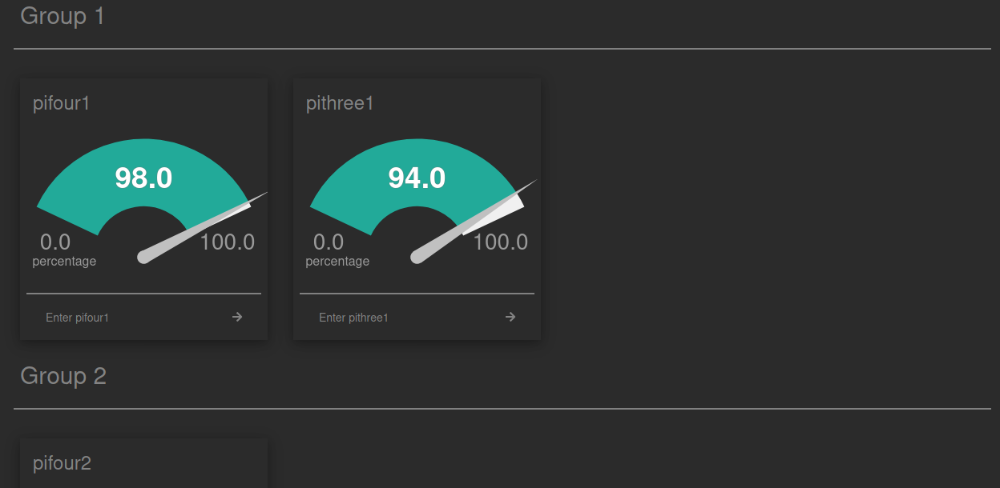

# NetBoard
[](https://www.codefactor.io/repository/github/satcom886/netboard)  
This should one day be a multiserver dashboard for Netdata. I'm hoping for this to read a config file where the user would define **groups** of **servers** and the website would add a card for each server (kinda like [Homer](https://github.com/bastienwirtz/homer) does). In fact the entire concept should look very similar to Homer.  

Once you install this, it should look like this:  


## Modifying the dashboard
In the future this shouldn't be needed, but for now you actually have to edit the HTML in order to get your servers onto the dashboard. There are a few places where you should replace the URL.  
First off is the `data-host`. Pretty self-explanatory.  
Second is on the button under the graph. This is a `onclick="location.href` property of the button.  
Third and final is what server `dashboard.js` is pulled from. This can be any Netdata server. It's on the bottom of the file.  
Adding more groups and servers is also pretty simple. There are comments indicating the beginnings and ends of groups/servers in the HTML file.

## The general look
The theme should be pretty similar to the normal Netdata dashboard.  
Servers should be in "cards" or "tiles", each tile having a name as the heading, CPU meter, possibly a graph and a button saying "Enter [name of the server]".  
Groups are separated by a heading and a bit of a space.  

This is the look I'm going for. The categories would be the groups and the individual items would be the servers.  
  
I'd really like to avoid much server-side setup, so ideally this would be in JS instead of PHP.  
Below are just notes for myself, you can just ignore that...  

the python pseudo-code for this (please forgive me)
```python
for group in groups:
    print(group w3-h2)
    for server in servers:
        print(w3-card)
        print(server w3-h3)
        chart()
        button()
```

```python
for server in servers:
    group = server.group
    counter +=1
    if group == server.group:
        print("The entire thing with the graph")
        servers.pop(counter)
    elif group != server.group:
        pass
```
hey... this doesn't look that difficult...